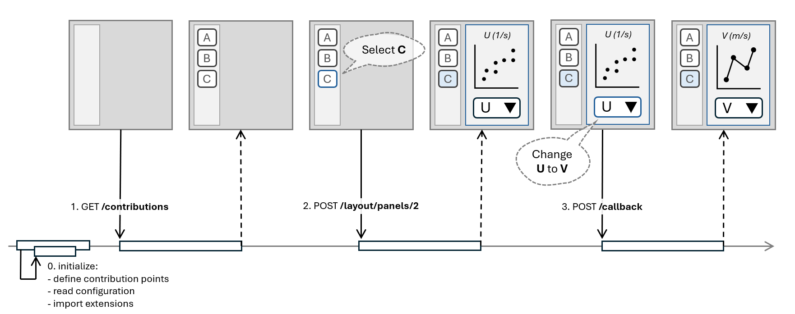

# Providers guide

As an application provider you allow for enhancing your web application by
server-side UI-contributions provided by an application contributor.

## How Chartlets works

The basic idea is that application contributors develop the 
UI-contributions in Python and a REST server developed by you, the
application provider, implements three endpoints to publish the 
UI-contributions to a frontend application:

- `GET /contributions`: Called once after application UI starts up.
  Returns an object whose keys are contribution points (e.g., "panels")
  and whose values are arrays of contribution objects.
- `POST /layout/{contribPoint}/{contribIndex}`:
  Called once for every contribution when it becomes visible in the UI.
  Returns the contribution's initial component tree.
- `POST /callback`:
  Called when application users interact with the component tree or on 
  application state changes. Returns an array of contribution changes where 
  each contribution change contains an array of actions to be applied to the
  component tree.

The following sequence diagram depicts the framework in action. 
The top shows the frontend application that uses the Chartlets JavaScript
library. The bottom shows the lifeline of the backend REST server that uses
the Chartlets Python library.



## REST server integration

The Chartlets backend implementation is provided by the module 
`chartlets.controllers` of the Python package `chartlets`.
It makes it easy to integrate the Chartlets endpoints in your preferred
webserver framework, such as Flask, FastAPI, or Tornado.

The following steps are required to enable your web server to support
UI-contributions:

1. Update project dependencies 
2. Implement the possible contributions
3. Define the contribution points
4. Load the extensions
5. Publish the extensions 

In the following the above steps are detailed further. 

### Update project dependencies

Add the Python package `chartlets` to your project dependencies.
Currently, Chartlets is available from PyPI only.

### Implement the possible contributions

Implement the application-specific contributions that users 
can add to their extensions.

As an example, see [`panel.py` of the demo](https://github.com/bcdev/chartlets/tree/main/chartlets.py/demo/server/contribs/panel.py):

```python
from chartlets import Contribution


class Panel(Contribution):
    """Panel contribution"""

    def __init__(self, name: str, title: str | None = None):
        super().__init__(name, title=title)
```

### Define the contribution points

Define the possible contribution points in your application.

As an example, see [`app.py` of the demo server](https://github.com/bcdev/chartlets/tree/main/chartlets.py/demo/server/app.py):

```python
from chartlets import Extension
from .contribs import Panel

Extension.add_contrib_point("panels", Panel)
```

### Load the extensions

Load the extensions that augment your application.

As an example, see [`app.py` of the demo server](https://github.com/bcdev/chartlets/tree/main/chartlets.py/demo/server/app.py):

```python
from chartlets import ExtensionContext

ext_ctx = ExtensionContext.load(app_ctx, extension_refs)
```

### Publish the extensions 

Implement the Chartlets API in your application-specific webserver using
the controller implementations in `chartlets.controllers`. 

As an example, see [`app.py` of the demo server](https://github.com/bcdev/chartlets/tree/main/chartlets.py/demo/server/app.py).

## Application UI integration

The JavaScript package `chartlets` provides the types, actions, and hooks
to allow for supporting server-side UI contributions in your React 
application. 

As an example, see [the demo application](https://github.com/bcdev/chartlets/tree/main/chartlets.js/packages/demo/src).

As an application provider you will need to perform the 
following steps:

1. Update project dependencies 
2. Configure the framework
3. Implement derived application state
4. Render the contributions

### Update project dependencies

Add the `chartlets` package as a dependency to your `package.json`.
The package provides also TypeScript type definitions.
There is nothing more to be considered.

### Configure the framework

To configure the framework and fetch the initial contributions from the
server the `initializeContributions` function must be called once in your
application. In the following example, the default plugins are used. 

```TypeScript
import { initializeContributions } from "chartlets";
import mui from "chartlets/plugins/mui";
import vega from "chartlets/plugins/vega";

initializeContributions({
  plugins: [mui(), vega()],
  ...
});
```

If you need to separate configuration and fetching configurations you can also
pass the options to the `configureFramework` function and call 
`initializeContributions` without options.

### Implement derived application state

_Coming soon._

### Render the contributions

_Coming soon._

## Extending the framework

### Add your Plugins

#### DataGrid Usage from Chartlets v0.1.5
In the `v0.1.5` release of Chartlets, the `@mui/x-data-grid` library was removed 
from `peerDependencies`. This change was made to give users the flexibility 
to install the library only if needed, as it is relatively large 
(>6MB at the time of writing).

However, the `DataGrid` component remains fully supported. To use it, 
follow these steps:

0. Install `@mui/x-data-grid` in your application

```shell
  npm i @mui/x-data-grid
```

1. Create a Plugin Function 

Define a plugin function that integrates DataGrid with Chartlets.

```typescript
import { DataGrid } from "chartlets/packages/lib/src/plugins/mui/DataGrid";
import type { Plugin } from "chartlets";

export default function your_plugin(): Plugin {
  return {
    components: [
      ["DataGrid", DataGrid],
    ],
  };
}

```
2. Pass the Plugin to `initializeContributions`
Register the plugin within Chartlets using initializeContributions.

```typescript
import your_plugin from "./plugin";

initializeContributions({
      plugins: [your_plugin()],
      .....
})
```
Once this setup is complete, `DataGrid` will be available for use, allowing 
users to create server-side panels using this component. 

_More Coming soon._

